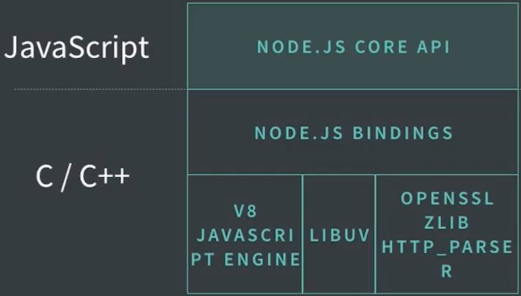

# Curso Avanzado de Node.js

Node es una plataforma OpenSource para desarrollar aplicaciones, que está enfocada en tiempo real. Es similar a la máquina virtual de Java.

Node es muy útil para aplicaciones que tienen alta concurrencia. Utiliza JavaScript como lenguaje de programación y patrones de programación asíncronos y orientados a objetos.

¿Por qué decimos que Node.js es una plataforma simple?

1. Es una librería estándar es donde el código va a morir. Mantener una plataforma estándar actualizada puede ser un problema.
2. npm y la modularidad de Node abre un ecosistema de trabajo muy grande.
3. El modelo de trabajo Open Source beneficia mucho a la plataforma.

## Arquitectura de Node.js

Node existe gracias a un componente principal que se llama V8, que es el que nos permite utilizar JavaScript del lado del servidor.

* `Node.js core API` Es el conjunto de librerías escritas en Javascript con las cuales interactuamos.
* `Node.js bindings` Permite comunicar la capa escrita en Javascript con las librerías de bajo nivel.
* `V8 Javascript engine` Máquina virtual de Javascript, es el componente principal de Node que nos permite ejecutar Javascript fuera del navegador.
* `Libuv`: Librería encargada de manejar el event loop en Node (Loop de ejecución de tareas asíncronas), también se encarga de las operaciones de red y operaciones de entrada y salida del sistema de archivos.
* `OpenSSL`: Para comunicación segura.
* `Zlib`: Encriptación.
* `Http_paser`: Para hacer el parseo de el protocolo http.

## Características de la plataforma Node.js

**Networking e I/O**

Un poco más de 1/4 del core de Node está dedicado a Networking e I/O. Teniendo en cuenta lo anterior Node es muy útil creando aplicaciones de entrada y salida (con alta concurrencia y cargas de trabajo muy altas, como leer archivos muy grandes) y aplicaciones que requieran transmitir información en la red.

Dentro del core de Node existen módulos que permiten que esta plataforma sea tan poderosa en la creación networking. Algunos de estos son:

* `HTTP` para usar servidores HTTP.
* `HTTPS` es el protocolo seguro de HTTP, usando TLS/SSL.
* `Net` proporciona una API de red asíncrona para la creación de TCP basada en secuencias o IPC.
* `Dgram` presenta una implementación de sockets UDP.
* `DNS` brinda funciones para resolver nombres, ya sea conectándose a un servidor DNS o con operaciones del sistema operativo subyacente.

**Modular**

El userland de Node es NPM (The Node Package Manager): el manejador de paquetes más grande del mundo. Además, es open source, lo que permite que el ecosistema de Node sea muy grande y crezca cada vez más.

Node sigue la filosofía de que “los módulos deben ser pequeños, que se concentren en hacer una cosa y que la hagan bien” (alta cohesión). De esta forma, las aplicaciones de Node son un sistema de módulos especializados que interactúan entre sí, esto a su vez hace que las aplicaciones no sean monolíticas (una aplicación monolítica se puede entender como una aplicación en la que los módulos son muy dependientes entre ellos, alto acoplamiento, lo cual es indeseable en desarrollo de software pues es aplicación muy dificil de mantener).

La modularidad resuelva el _dependency hell_ (infierno de dependencias) el cual se resultado de conflictos entre las versiones de las dependencias de un proyecto, que pueden entrar en conflicto con las de otra aplicación o proyecto, Node soluciona esto infierno de dependencias de manera local y por proyecto, debido a que su cargador de módulos puede cargar dos o más versiones de un mismo módulo sin que entren en conflicto, fuente.

**JavaScript en el servidor**

JavaScript es el lenguaje del navegador. Con Node JavaScript ha llegado al servidor. Esto hace que a un desarrollador frontend se le haga más fácil desarrollar de parte del servidor (backend) pues es el mismo lenguaje tanto para front como para back haciendo que sean altamente productivos.

**Asíncrono**

EcmaScript está trabajando constantemente en mejorar el lenguaje. Entre estas mejoras están: async await, clases, promesas nativas, entre otras. Estas nuevas características permiten que en Node se trabaje de una forma asíncrona y orientada a eventos, lo que hace que sea una plataforma ideal para aplicaciones en tiempo real.

La programación asíncrona en Node es posible por medio de callbacks, eventos y promesas. En Node las operaciones de entrada y salida no hacen que el event loop se bloquee. Esto debido a que, aunque solo tengamos un hilo disponible para el usuario, Node tiene 4 hilos por defecto, para ejecutar tareas sin bloquear el hilo de ejecución de la aplicación.

## Ventajas y desventajas

Para que es bueno
* Aplicaciones en Red.
* Aplicaciones de entrada y salida.
* Orquestación entre múltiples aplicaciones.

Para que no es bueno
* Bigdata.
* Procesamiento intensivo de CPU.
* Aplicaciones de Sistemas y para manejar componentes nativas.

## Enlaces de Interés
* https://platzi.com/clases/nodejs/