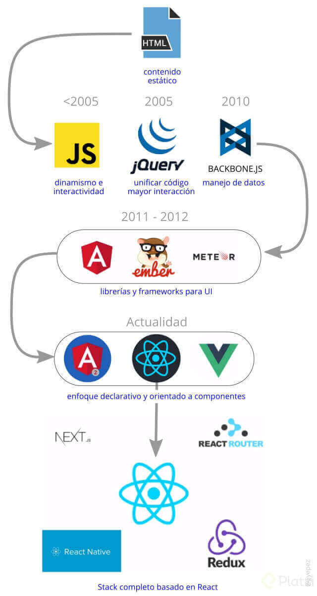
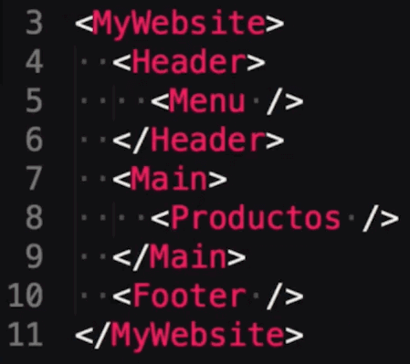

# Curso de React.js

React = Librería de JavaScript para construir interfaces de usuarios.

Las necesidades del Frontend han ido en aumento a medida que han pasado los años. Todo el enfoque ha sido encaminado a mejorar todos los aspectos que hagan que la experiencia de usuario sea mucho mejor, esto le ha dado más responsabilidades al área de Frontend.



**Particularidades de ReactJS**
* Declarativo. Es muy sencillo escribir interfaces y poderlas leer.

* Basado en componentes. Crear aplicaciones con React es como jugar con Legos donde cada ficha es un componenete.
* Aprende de una vez y escribe donde quieras.

**Librerías de React**
* `React` El core. Construye interfaces e interacción.
* `React router` Navegar sin recargar el browser.
* `Redux` Manejar el estado global de la aplicación.
* `React Native` Interfaces de aplicaciones mobiles.
* `Next.js` Framework en el servidor.

## Instalación de React

**create-react-app** 

Es un boilerplate (estructura de archivos y paquetes base) para iniciar un proyecto en React de manera fácil.

```bash
$ npm install -g create-react-app 
```

Para arrancar la aplicación react se usa el comando `create-react-app`.

```bash
$ create-react-app app-name
```

**Instalación Customizada**

Iniciar un proyecto de Javascript

```bash
$ npm init
```

En el `package.json` que se ha creado, agregar las siguientes dependencias de desarrollo:

```json
"devDependencies": {
  "babel-core": "^6.26.3",
  "babel-loader": "^7.1.5",
  "babel-preset-es2015": "^6.24.1",
  "babel-preset-react": "^6.24.1",
  "babel-preset-stage-2": "^6.24.1",
  "clean-webpack-plugin": "^0.1.19",
  "css-loader": "^1.0.0",
  "extract-text-webpack-plugin": "^4.0.0-beta.0",
  "file-loader": "^1.1.11",
  "optimize-css-assets-webpack-plugin": "^4.0.3",
  "style-loader": "^0.21.0",
  "uglifyjs-webpack-plugin": "^1.2.7",
  "url-loader": "^1.0.1",
  "webpack": "^4.15.1",
  "webpack-cli": "^3.0.8",
  "webpack-dev-server": "^3.1.4"
}
```

Instalar las dependencias de desarrollo.

```bash
$ npm install
```

Se usará Webpack para la traspilacipón de archivos. Para eso se tiene que configurar los archivos de configuración tanto para producción como desarrollo:

```javascript
//webpack.config.js
const path = require("path");
const ExtractTextPlugin = require("extract-text-webpack-plugin");
const CleanWebpackPlugin = require("clean-webpack-plugin");
const UglifyJsPlugin = require("uglifyjs-webpack-plugin");
const OptimizeCSSAssetsPlugin = require("optimize-css-assets-webpack-plugin");

module.exports = (env) => {
  const plugins = [
    new ExtractTextPlugin("css/[name].[hash].css")
  ]

  if (env.NODE_ENV === "production") {
    plugins.push(
      new CleanWebpackPlugin(["dist"], { root: __dirname })
    )
  }

  return {
    mode: "production",
    entry: {
      "platzi-video": path.resolve(__dirname, "index.js")
    },
    output: {
      path: path.resolve(__dirname, "dist"),
      filename: "js/[name].[hash].js",
      publicPath: path.resolve(__dirname, "dist") + "/",
      chunkFilename: "js/[id].[chunkhash].js"
    },
    devServer: {
      port: 9000
    },
    module: {
      rules: [
        {
          test: /\.(js|jsx)$/,
          exclude: /(node_modules)/,
          use: {
            loader: "babel-loader",
            options: {
              presets: ["es2015", "react", "stage-2"]
            }
          }
        },
        {
          test: /\.css$/,
          use: ExtractTextPlugin.extract({
            use: [
              {
                loader: "css-loader",
                options: {
                  minimize: true
                }
              }
            ]
          })
        },
        {
          test: /\.(jpg|png|gif)$/,
          use: {
            loader: "url-loader",
            options: {
              limit: 10000,
              fallback: "file-loader",
              name: "images/[name].[hash].[ext]"
            }
          }
        },
        {
          test: /\.(woff|eot|ttf|svg)$/,
          use: {
            loader: "url-loader",
            options: {
              limit: 10000,
              name: "fonts/[name].[ext]"
            }
          }
        }
      ]
    },
    plugins,
    optimization: {
      minimizer: [
        new UglifyJsPlugin(),
        new OptimizeCSSAssetsPlugin({})
      ]
    }
  }
}
```
```javascript
//webpack.dev.config.js
const path = require("path");

module.exports = {
  mode: "development",
  entry: {
    "platzi-video": path.resolve(__dirname, "index.js")
  },
  output: {
    path: path.resolve(__dirname, "dist"),
    filename: "js/[name].js"
  },
  devServer: {
    port: 9000
  },
  module: {
    rules: [
      {
        test: /\.(js|jsx)$/,
        exclude: /(node_modules)/,
        use: {
          loader: "babel-loader",
          options: {
            presets: ["es2015", "react", "stage-2"]
          }
        }
      },
      {
        test: /\.css$/,
        use: ["style-loader", "css-loader"]
      },
      {
        test: /\.(jpg|png|gif)$/,
        use: {
          loader: "url-loader",
          options: {
            limit:100000,
            fallback: "file-loader",
            name: "images/[name].[hash].[ext]"
          }
        }
      },
      {
        test: /\.(woff|eot|ttf|svg)$/,
        use: {
          loader: "url-loader",
          options: {
            limit:100000, //Hasta qué limite de bytes va a hacer una transfortmación a base64
            name: "fonts/[name].[ext]"
          }
        }
      }
    ]
  }
}
```
Agregar los scripts para usar Webpack en el `package.json`.

```json
"scripts": {
  "build:dev": "webpack-dev-server --config ./webpack.dev.config.js",
  "build": "webpack",
  "build:local": "webpack --env.NODE_ENV=local",
  "build:prod": "webpack -p --env.NODE_ENV=production"
}
```

Correr uno de los scripts de acuerdo a la necesidad:

```bash
$ npm run build
$ npm run build:dev
$ npm run build:local
$ npm run build:prod
```

Por último, parsa usar React se debe de instalar `react` y `react-dom`.

```bash
npm install react react-dom
```

## Bases de React

React sirve para crear componentes de la aplicación y dividirlo en bloques.

### React DOM

ReactDOM sirve para renderizar en el navegador.

ReactDOM.render recibe dos parámetros
1. Qué se va a renderizar.
2. Donde se va renderizar.

```javascript
import React from "react";
import ReactDOM from "react-dom";

const app = document.getElementById("app");
const holaMundo = <h1>hola mundo</h1>;

ReactDOM.render(holaMundo, app);
```

### Componentes

Existen tres tipos de componentes:
* `Funcional` Este tipo de componentes se definen como funciones y no tienen estados ni trabajan con ellos.
* `Puro` Se implementan como clases, pero en este caso, van a extender de React.PureComponent.
* `Normal o de Estado` Utilizan la encapsulación en clases. Tienen un estado que definen y actualizan.

Los componentes deben de seguir estas reglas:
* Se escriben en Pascal Case. 
* Se usa la sintaxis `JSX` para contruir los elementos.
* Se puede usar la extensión `.js` o `.jsx`.
* Se debe de exportar el componente para que pueda ser usado posteriormente.

Ejemplo de un componente:

```jsx
//HolaMundo.jsx
import React, { Component } from "react";

class HolaMundo extends Component {
  render() {
    return (
      <h1>Hola Mundo</h1>
    )
  }
}

export default HolaMundo;
```

Ejemplo de cómo usar un componente:

```jsx
//index.js
import React from "react";
import { render } from "react-dom";
import HolaMundo from "./src/js/components/HolaMundo.jsx";

render(<HolaMundo/>, app);
```

### Estilos CSS

**Estilos inline**

* Los estilos se crean como si fueran un objeto json.
* Por convensión, las propiedades se escriben en `Cammel Case`.
* El tamaño por defecto es px. Esto quiere decir que no es necesario agregarlo cuando esta sea la medida a aplicar.

```jsx
import React, { Component } from "react";

class Media extends Component {
  render() {

    const styles = {
      container: {
        fontSize: 14
      }
    }

    return (
      <div style={styles.container}></div>
    )
  }
}

export default Media;
```

**Archivos .css**

Los archivos `.css` se importan con un import dentro del archivo `.js` o `.jsx`.

```javascript
import "./media.css";
```

Para usarlos dentro de un elementos JSX se usa el atributos `className`.

```html
<div className="Media">
```

### Propiedades

Lo que se conoce como `atributos` en HTML, se llama `propiedades` en JSX.

#### Pasar propiedades a un componente

Al crear un componente se requiere que estos tengan datos dinámicos de tal manera que se puedan reutilizar. 

Para esto, podemos pasar las propiedades a los componentes en el momento que los referenciamos.

```jsx
render(<Media title="¿Qué es responsive design?"/>, app);
```

Para indicar en dónde se va a poner la propiedad dentro del componente se usa `this.props`.

```jsx
<h1>{this.props.title}</h1>
```

También se puede extraer la propiedad de this.props y usarlas de una forma más directa en el componente.

```javascript
const {title} = this.props; 
```

```jsx
<h1>{title}</h1>
```

#### Validado de propiedades

Es importante validar las propiedades para que el componente pueda funcionar correctamente.

Para realizar el validado se va a usar `prop-types`.

```bash
npm install prop-types -D
```

Para usar prop-types primero hay que importarlo.

```js
import PropTypes from "prop-types";
```

Para realizar las respectivas validaciones se va a usar `Media.propTypes`. Esto se agrega al final del componente (entre la clase y el export) y contiene las validaciones respectivas por cada propiedad.

**Tipo de dato**

Para validar el tipo de dato a recibir, se agrega `PropTypes` seguido del tipo de dato que se recibir. 

```js
Media.propTypes = {
  image: PropTypes.string
}
```
Los tipos de `PropTypes` que se pueden recibir son los siguientes:
* `func` Funcione
* `string` Texto
* `object` Objeto
* `bool` Booleano
* `number` Número
* `array` Array

**Lista de elementos**

```js
Media.propTypes = {
  type: PropTypes.oneOf(["video", "audio"])
}
```

**La propiedad es obligatoria**

```js
Media.propTypes = {
  title: PropTypes.string.isRequired
}
```

Cuando exista un error al pasar una propiedad se va a mostrar un warnning en la consola. 

Documentación completa de prop-types:
https://reactjs.org/docs/typechecking-with-proptypes.html

### Enlazando eventos del DOM

Para enlazar un evento al DOM se hace añadiendo un `on + Event` (ejemplo, onClick) y así asignarle el nombre de la función. Por convención, se asigna `handle + Event` (ejemplo, handleEvent)

```jsx
<div onClick={this.handleClick}>
```

Luego se puede hacer la implementación de la función fuera del render. Si se desea usar las propiedades que han sido pasadas se hace lo siguiente:

**ES6**

Hacer una función constructor en donde se cambia el contexto del evento.

```js
constructor() {
  super(props);
  this.handleClick = this.handleClick.bind(this);
}
```

**ES7**

Implementar el evento como un arrow function ya que estas, por defecto, heredan el contexto del padre.

```js
handleClick = (event) => { 
  console.log(this.props.title);
}
```

Documentación completa del manejo de eventos:
https://reactjs.org/docs/handling-events.html

## Enlaces de Interés
* https://platzi.com/clases/react/
* https://github.com/LeonidasEsteban/platzi-video
* https://github.com/facebook/create-react-app